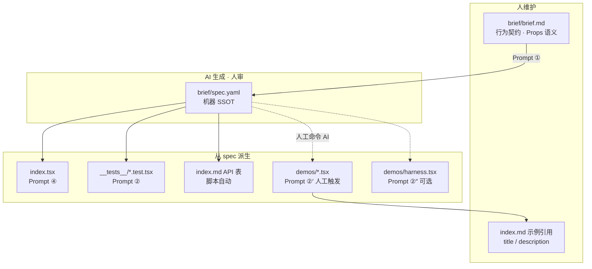
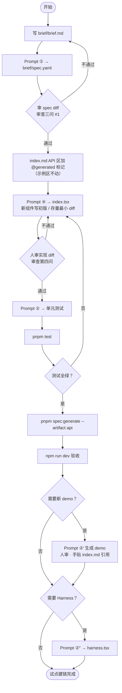
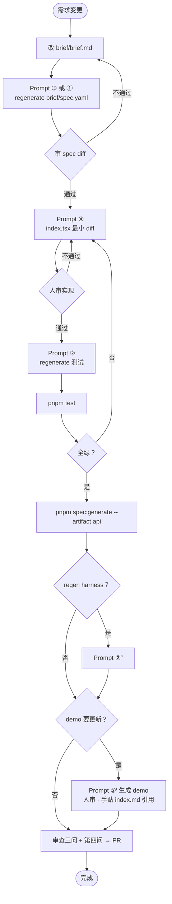
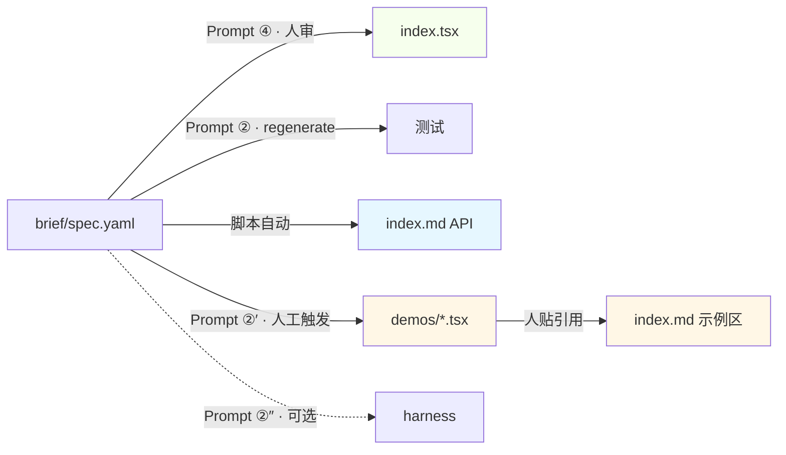
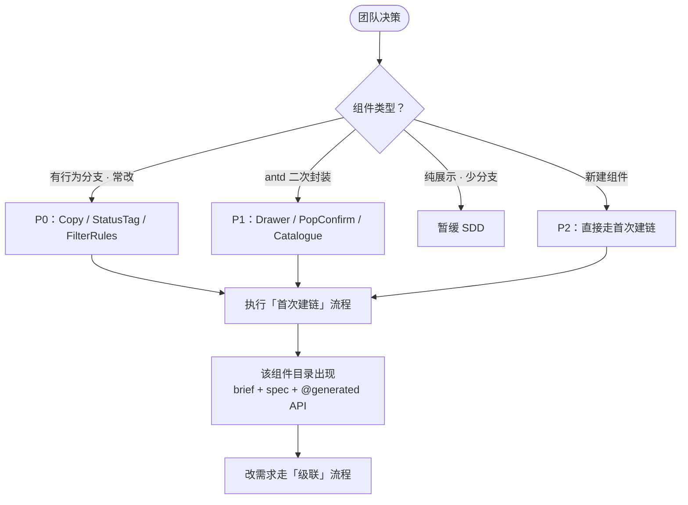
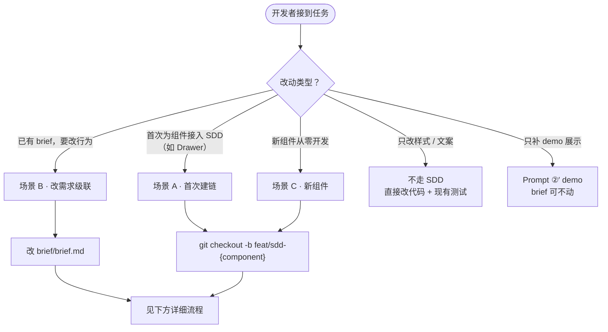
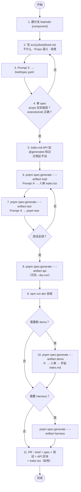
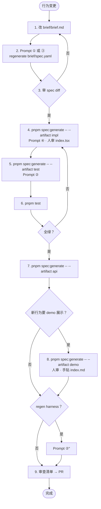
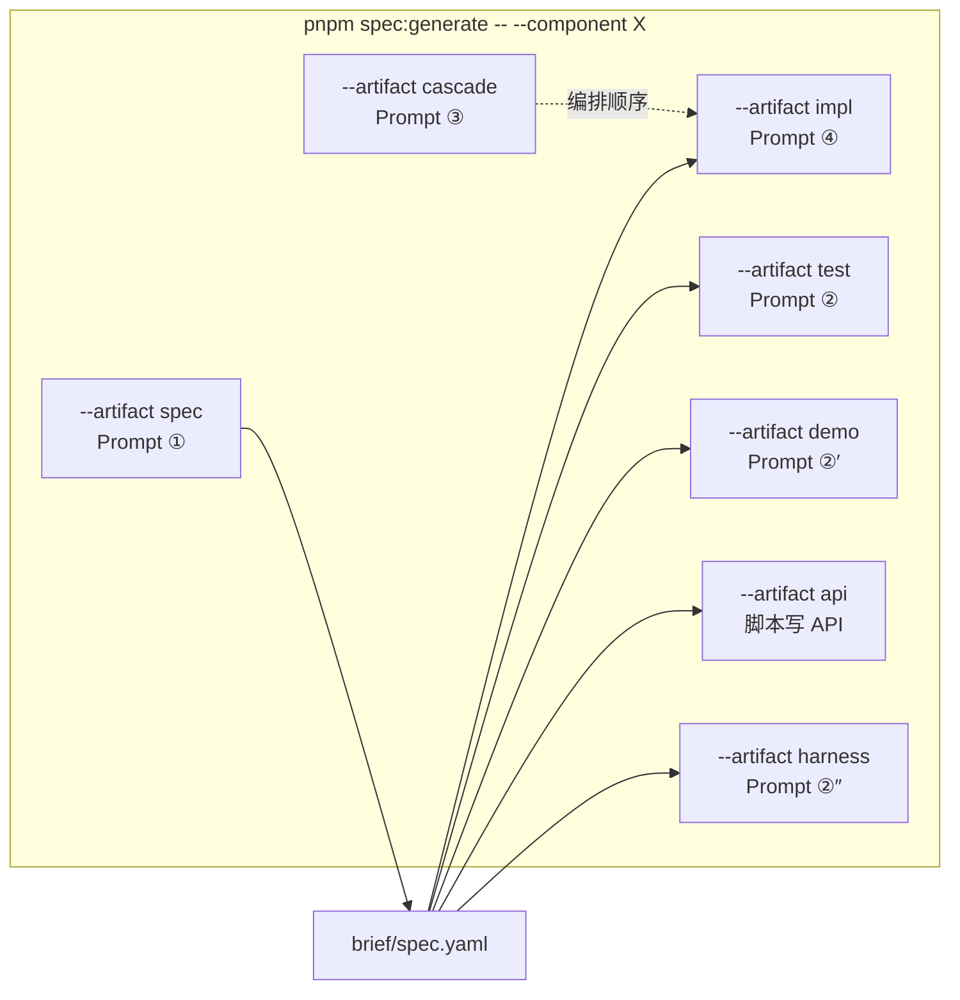

# SDD + Harness 实践指南（dt-react-component）

**一句话：** 人维护 `brief/brief.md` → AI 生成 `brief/spec.yaml` → 派生**测试、API、实现（④）、Demo（②′ 人工触发）、Harness（②″ 可选）**。

**试点组件：** [Copy](../../src/copy/brief/brief.md)

## 贡献者速查：唤起命令

派生步骤**不会自动跑**——需要你在终端打命令拿到 Prompt，再**复制到 Cursor 对话**发送（`api` 除外，脚本直接写文件）。

把 `Copy` 换成目标组件名即可：

```bash
# ① 根据 brief + index.tsx，生成 / 更新 brief/spec.yaml
pnpm spec:generate -- --component Copy --artifact spec

# ③ 看当前 git diff，告诉你 brief / spec / 实现 / 测试 / API / demo
#    哪些要改、按什么顺序改（改需求时先跑这个统筹，再按输出依次唤起）
pnpm spec:generate -- --component Copy --artifact cascade

# ④ 按 spec 对 index.tsx 做最小 diff（人审后再合）
pnpm spec:generate -- --component Copy --artifact impl

# ② 按 spec 生成 / 更新单元测试
pnpm spec:generate -- --component Copy --artifact test

# 按 spec 自动同步 index.md 的 API 表（唯一自动写文件；可先 --dry-run）
pnpm spec:generate -- --component Copy --artifact api
pnpm spec:generate -- --component Copy --artifact api --dry-run

# ②′ 按需生成 dumi demo（先填打印稿里的「设计意图」，再贴到 Cursor）
pnpm spec:generate -- --component Copy --artifact demo

# ②″ 按需生成 Harness 验规格面板（可选，不阻塞主流程）
pnpm spec:generate -- --component Copy --artifact harness

# 一次打印全部 Prompt，并同步 API 表
pnpm spec:generate -- --component Copy --artifact all

# 查看帮助
pnpm spec:generate -- --help
```

| 步骤         | 命令                 | 你要做的事                                                                            |
| ------------ | -------------------- | ------------------------------------------------------------------------------------- |
| ① spec       | `--artifact spec`    | 复制 Prompt → Cursor → 审 `brief/spec.yaml`                                           |
| ③ 改需求统筹 | `--artifact cascade` | 改行为后先跑：AI 读 git diff，输出「还要改什么、按何顺序」；再按清单依次跑 ①/④/②/api… |
| ④ 实现       | `--artifact impl`    | 复制 Prompt → Cursor → 人审 `index.tsx` diff                                          |
| ② 测试       | `--artifact test`    | 复制 Prompt → Cursor → `pnpm test`                                                    |
| API          | `--artifact api`     | **无需 Cursor**；脚本更新 `index.md` API 区                                           |
| ②′ Demo      | `--artifact demo`    | 填设计意图 → Cursor → 人审 → **手贴** index.md                                        |
| ②″ Harness   | `--artifact harness` | 复制 Prompt → Cursor（可选）                                                          |

推荐顺序：`spec` → `impl` → `test` → `api` →（按需）`demo` / `harness`。

完整 Prompt 正文见下文「Prompt 模板」；与 CLI 打印内容一致。

## 流程总览

### 架构：谁维护什么



### 首次建链（新组件 / 试点接入）



### 改需求级联（日常维护）



### 产物更新方式一览



### 全库推广（opt-in）



### 开发者入口：我该走哪条路？



### 场景 A / C：首次建链（Drawer、新组件）



### 场景 B：已有 brief · 组件行为变更



### spec:generate 与各 Prompt 对应关系



> 用法：终端跑命令 → 复制打印的 Prompt → 粘贴到 Cursor。详见文首[贡献者速查](#贡献者速查唤起命令)。

## 设计原则（低变更）

| 区块                                                          | 谁维护                    | SDD 介入方式                                   |
| ------------------------------------------------------------- | ------------------------- | ---------------------------------------------- |
| `index.md` **示例引用**（title / description / `<code src>`） | 人贴入                    | **②′ 输出建议行**，不自动改 index.md           |
| `demos/*.tsx`                                                 | AI 生成 + **人审**        | **Prompt ②′**（人工按需触发，非级联必跑）      |
| `index.md` **API 表**                                         | spec 派生                 | **自动** — `pnpm spec:generate --artifact api` |
| `index.tsx` **实现**                                          | spec 驱动 + **人审 diff** | **Prompt ④**                                   |
| `__tests__/*.test.tsx`                                        | spec 派生                 | **Prompt ②**                                   |
| `demos/harness.tsx`                                           | spec 派生（可选）         | **Prompt ②″**                                  |

### 为什么 `index.tsx` 不用一键 regenerate？

| 产物        | 与 spec 关系                          | 更新方式                      |
| ----------- | ------------------------------------- | ----------------------------- |
| 测试 / API  | spec 的**直接翻译**                   | 可整段 regenerate             |
| `index.tsx` | spec 的**一种实现**（多种写法都合法） | **Prompt ④ 最小 diff + 人审** |

spec 约束「该怎么表现」；实现里的 hooks 拆分、性能、样式细节仍由人把关，避免覆盖已有工程决策。

SDD 为 **opt-in**：仅带 `brief/brief.md` 的组件走此流程，其它组件零影响。

## 目录约定

```plain
src/{component}/
├── brief/
│   ├── brief.md               # 人维护 · 干什么 / Props / 场景
│   └── spec.yaml              # AI 生成 · 人审
├── index.tsx                  # Prompt ④ 按 spec 最小更新 · 人审
├── index.md                   # 示例手维护；API 表为 @generated 区块
├── __tests__/{component}.test.tsx
└── demos/
    ├── basic.tsx …            # Prompt ②′ 生成 · 人审
    └── harness.tsx            # 可选
```

## 工作流

### brief 写什么（仅此三节）

| 节             | 写什么                                                               | 不写什么                                      |
| -------------- | -------------------------------------------------------------------- | --------------------------------------------- |
| **干什么**     | 一句话职责                                                           | 实现细节、文件路径                            |
| **Props 语义** | 每个对外 prop 的行为含义；有 antd 继承时在此注明「其余继承 antd X」  | 测试栈、CLI、派生产物流程                     |
| **场景**       | 应有行为分支（建议带稳定 id，如 `click-copy`）；边界可写在对应场景里 | 单独的 outOfScope 大节、Harness / demo 映射表 |

`outOfScope`、`extendsAntd`、`testFixtures`、`linkedDemos`、`harnessMeta` **由 Prompt ① 写入 spec**（结合 brief + `index.tsx` / 现有 demos），人在审 spec 时裁剪即可。

### 首次建链

```plain
① 写 brief/brief.md
② Prompt ① → brief/spec.yaml → 审 spec diff
③ Prompt ④ → index.tsx 最小 diff（新组件则实现初始版本）→ 人审
④ Prompt ② → 测试 → pnpm test
⑤ pnpm spec:generate -- --component {Name} --artifact api
⑥ （按需）Prompt ②′ → demos/*.tsx → 人审 → 手贴 index.md 引用
⑦ （可选）Prompt ②″ → demos/harness.tsx
```

### 改需求（级联 · Prompt ③）

```plain
改 brief
  → Prompt ③ / ① regenerate brief/spec.yaml → 审 spec
  → Prompt ④ 更新 index.tsx（最小 diff）→ 人审
  → Prompt ② regenerate 测试 → pnpm test
  → pnpm spec:generate -- --artifact api
  → （按需）Prompt ②′ demo → 人审 → 手贴 index.md
  → （可选）regen harness
```

**推荐顺序：** brief → spec → **实现（④）** → 测试（②）→ API（脚本）。先改实现，测试用于验证。

## Prompt 模板

> **优先用 CLI 打印**（路径已按组件名填好）：见文首[贡献者速查](#贡献者速查唤起命令)。  
> 下文为全文存档；将 `Copy` / `copy` 替换为目标组件名亦可手改。

### Prompt ① brief + 源码 → spec

```bash
pnpm spec:generate -- --component Copy --artifact spec
```

```text
阅读 src/copy/brief/brief.md 与 src/copy/index.tsx，
生成 src/copy/brief/spec.yaml。

brief 通常只有「干什么 / Props 语义 / 场景」三节。
据此生成：props（**仅封装层**；先属性后方法 onXxx，组内 a–z）、
scenarios（id 对齐 brief 场景）、outOfScope、testFixtures、
harnessMeta、linkedDemos（对照现有 demos/）、extendsAntd（仅当 Props 写明继承 antd/rc）。

brief 未写清处从源码推断并标 aiSupplement: true。
@generated-from: brief/brief.md
```

### Prompt ② spec → 测试

```bash
pnpm spec:generate -- --component Copy --artifact test
```

```text
根据 src/copy/brief/spec.yaml 生成 src/copy/__tests__/copy.test.tsx。
Jest + Testing Library；每个 scenarios.id 一个 it(...)；不测 outOfScope。
@generated-from: brief/spec.yaml
```

### Prompt ②′ spec + 设计意图 → Demo（人工触发 · 人审）

**不在自动级联内**——当你需要新增/改版 demo 时：

```bash
pnpm spec:generate -- --component Copy --artifact demo
```

先填打印稿里的「设计意图」，再在 Cursor 发送。等价全文示例：

```text
为 Copy 组件生成 dumi demo。

【设计意图 — 发送前填写】
- demo 文件：demos/tooltip-variants.tsx（新建或覆盖）
- 展示目的：对比 tooltip 字符串 / 对象 / 函数三种写法
- 重点 props：text, tooltip
- 对应 scenarioId（可选）：tooltip-string, tooltip-object
- index.md 卡片 title：Tooltip 多种写法
- index.md 卡片 description：字符串、对象、函数形式配置 tooltip

【上下文 — AI 必读】
- src/copy/brief/brief.md
- src/copy/brief/spec.yaml
- src/copy/index.tsx
- 风格参考：src/copy/demos/basic.tsx

【生成要求】
1. 写出 demos/tooltip-variants.tsx，import { Copy } from 'dt-react-component'
2. 按「重点 props」组合展示，取值符合 spec.props 语义；不测 outOfScope
3. 遵循 RC demo 风格（BlockHeader / Space / 示例长文本等），单文件聚焦一个主题
4. 每个子示例用小标题区分，便于 dumi 卡片内阅读
5. **不要**直接修改 index.md；在回复末尾输出：
   - 建议粘贴的 `<code src='./demos/tooltip-variants.tsx' title="..." description='...'></code>` 一行
   - 若需更新 spec，输出 linkedDemos 片段供人粘贴
6. 生成后自查：npm run dev 下该 demo 可独立运行
```

**与 harness 的区别：** ②′ 面向**文档读者**（好看、有叙事）；②″ 面向**维护者验 spec**（控件 + 核对清单）。

### Prompt ②″ spec → Harness（可选）

```bash
pnpm spec:generate -- --component Copy --artifact harness
```

```text
根据 src/copy/brief/spec.yaml 生成 src/copy/demos/harness.tsx。
不要修改 index.md 的「示例」区块。
```

### Prompt ④ spec → 实现（最小 diff · 人审）

```bash
pnpm spec:generate -- --component Copy --artifact impl
```

```text
阅读 src/copy/brief/spec.yaml 与 src/copy/index.tsx。

1. 逐条对比 spec.scenarios 与当前实现，列出「已满足 / 缺失 / 行为不一致」
2. 对 index.tsx 做**最小 diff**以满足 spec，要求：
   - 只改与 scenarios / props 语义相关的代码
   - 不碰 outOfScope
   - 不做无关重构（不重排 import、不改命名风格、不拆 hooks 除非 spec 要求）
   - 保持 ICopyProps 与 spec.props 一致
3. 若 spec 与 brief 冲突，在回复中指出，**不要擅自改 spec**
4. 改完后简述：每个 scenario.id 对应改了哪段逻辑
```

**新组件（无 index.tsx 或空壳）：** 同上 Prompt，第 2 步改为「按 spec 实现 index.tsx 初版」，仍遵循 outOfScope 与项目风格。

### Prompt ③ 改需求统筹（读 diff → 后续更新顺序）

改了 brief 或实现后，先跑这条：AI 根据 **git diff** 告诉你还要动哪些派生物、按什么顺序唤起（不是直接改代码）。

```bash
pnpm spec:generate -- --component Copy --artifact cascade
```

```text
见 git diff（brief / index.tsx / 测试）：

1. 建议 brief/brief.md 还需改哪几段
2. regenerate brief/spec.yaml 要点
3. 按顺序列出需执行的 Prompt：
   - ④ index.tsx（最小 diff）
   - ② 测试
   - pnpm spec:generate -- --component Copy --artifact api
   - （按需）②′ demo
   - （可选）②″ harness
4. demo 是否需 Prompt ②′（对照 linkedDemos / 新 props 展示）
5. 审查三问 + 实现审查（见下）检查要点
```

## 实现审查（Prompt ④ 之后 · 第四问）

在「审查三问」基础上，改 `index.tsx` 后追加：

4. **实现 diff 是否仅满足 spec，无 scope 外改动？** 每个变更能否对应到 scenario.id 或 props 语义？

## index.md API 标记

首次接入时在 `### API` 下增加标记（**示例区块不动**）：

```markdown
### API

<!-- @generated-from: brief/spec.yaml -->

| 参数 | 说明 | 类型 | 默认值 |
| ... |

<!-- @generated-end -->
```

```bash
pnpm spec:generate -- --component Copy --artifact api
pnpm spec:generate -- --component Copy --artifact api --dry-run
```

### API 表排序规则（改 props / 同步时必须遵守）

`pnpm spec:generate --artifact api` 与人工改 API 表时，统一按：

1. **先属性，后方法** — 方法指 prop 名匹配 `on` + 大写字母（如 `onCopy`、`onChange`）；其余为属性（含 `children`、函数型 render 等）
2. **组内 a–z** — 属性组、方法组各自按参数名字母序（大小写不敏感）

示例顺序：`button` → `className` → `disabled` → `style` → `text` → `tooltip` → `onCopy`

### 继承 antd props（参考 Drawer）

API 表只列封装层 props；`extendsAntd` 自动生成 `:::info` 块：

```yaml
extendsAntd:
    component: Drawer
    docUrl: https://4x.ant.design/components/drawer-cn/#API
    version: '4.x'
    omit: "Omit<TreeProps, 'showLine' | 'showIcon'>" # 可选
```

## CLI

与文首[贡献者速查](#贡献者速查唤起命令)相同。`api` 是唯一自动写文件的 artifact；其余只打印 Prompt。

| artifact  | Prompt | 行为                                                                      |
| --------- | ------ | ------------------------------------------------------------------------- |
| `spec`    | ①      | 打印 Prompt（brief → spec）                                               |
| `cascade` | ③      | 打印 Prompt：读 git diff，列出 brief/spec/实现/测试/API/demo 后续更新顺序 |
| `impl`    | ④      | 打印 Prompt（`index.tsx` 最小 diff）                                      |
| `test`    | ②      | 打印 Prompt（单元测试）                                                   |
| `api`     | —      | **自动**写 `index.md` API 区块                                            |
| `demo`    | ②′     | 打印 Prompt（填设计意图后再发）                                           |
| `harness` | ②″     | 打印 Prompt（可选）                                                       |
| `all`     | 全部   | 按序打印 + 同步 API                                                       |

## 审查清单

1. spec 是否忠实反映 brief？
2. 测试 / API 是否覆盖 spec.props 与 scenarios，且未碰 outOfScope？
3. `pnpm test` 是否绿？API 表与 `index.tsx` interface 是否一致？**顺序是否「先属性后方法、组内 a–z」？**
4. **（改 demo 时）** props 展示与 spec 一致？单 demo 聚焦一主题？index.md 引用已手贴？
5. **（改实现时）** index.tsx diff 是否最小、且每条变更可对应 scenario？

## 验证清单（Copy 试点）

-   [ ] `brief/brief.md` 入库
-   [ ] `brief/spec.yaml` 审阅通过
-   [ ] Prompt ④ 对照 spec 审过 `index.tsx`
-   [ ] `copy.test.tsx` 从 spec 派生，`pnpm test` 绿
-   [ ] `pnpm spec:generate -- --component Copy --artifact api`
-   [ ] （按需）Prompt ②′ 生成 demo，`npm run dev` 目视验收
-   [ ] 完成一次 brief 变更 → ④ + ② + api 级联

## 延伸阅读

-   方法论：`AI Coding 2.0：SDD + Harness 实践指南`
-   batch Phase 1：`ResGroupSelector.brief.md` / `ResGroupSelector.spec.yaml`
